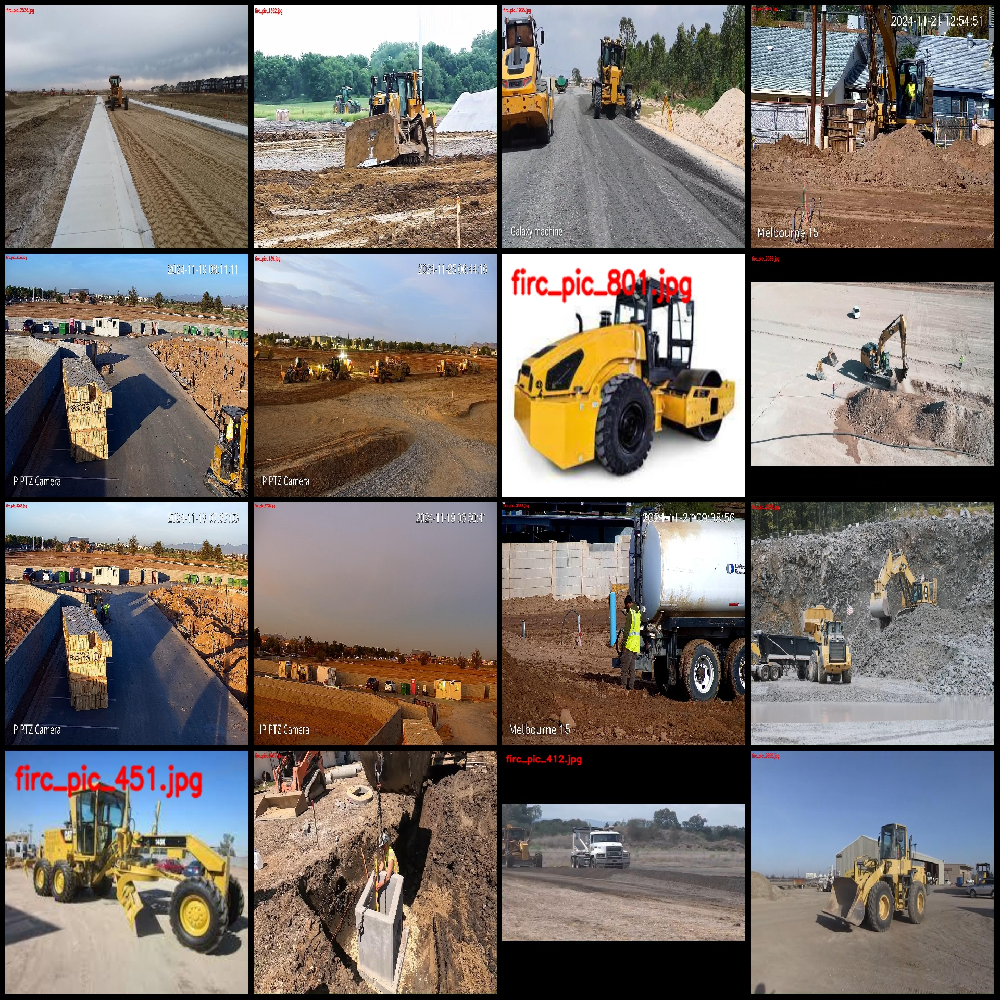
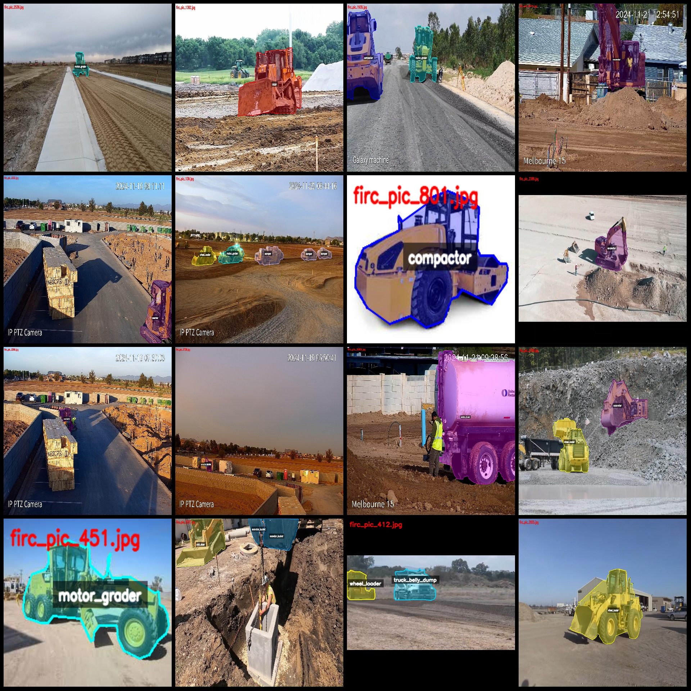
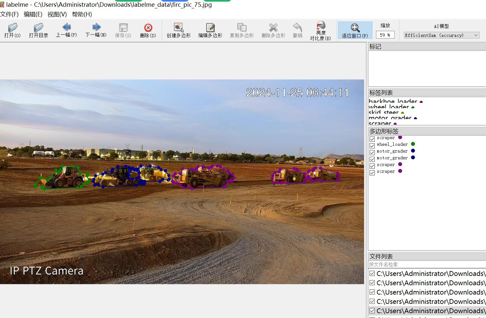

# 3823 Vehicles Identification and Classification: Excavator, Tractor, Sprinkler Truck, Roller, etc. LabelMe format with 13 categories

The dataset contains 3823 images, including 13 categories: articulated truck, excavator, compactor, bulldozer, backhoe, bulldozer, grader, skid-loader, boom truck, wheeled loaders, water trucks and wheeled dump trucks. The resolutions of these images include 1912x1054, 2560x1440, etc.

The annotation tool uses labelme=5.5.0. The annotation rule is to draw polygon boxes for each class.

Special Disclaimer: This dataset does not guarantee the accuracy of the trained model or the weights file.

Preview of the image:

[Click to view the annotation results.](path_to_your_json)

[Click to view an example of editing images.](path_to_your_labelme)
## Picture

Here is a pay link on Stripe ( https://buy.stripe.com/3cs8yP7sY87d0vu9AB ). Please contact me lonlonago@foxmail.com after funding $89, and I will send you a complete data files , thank you!

